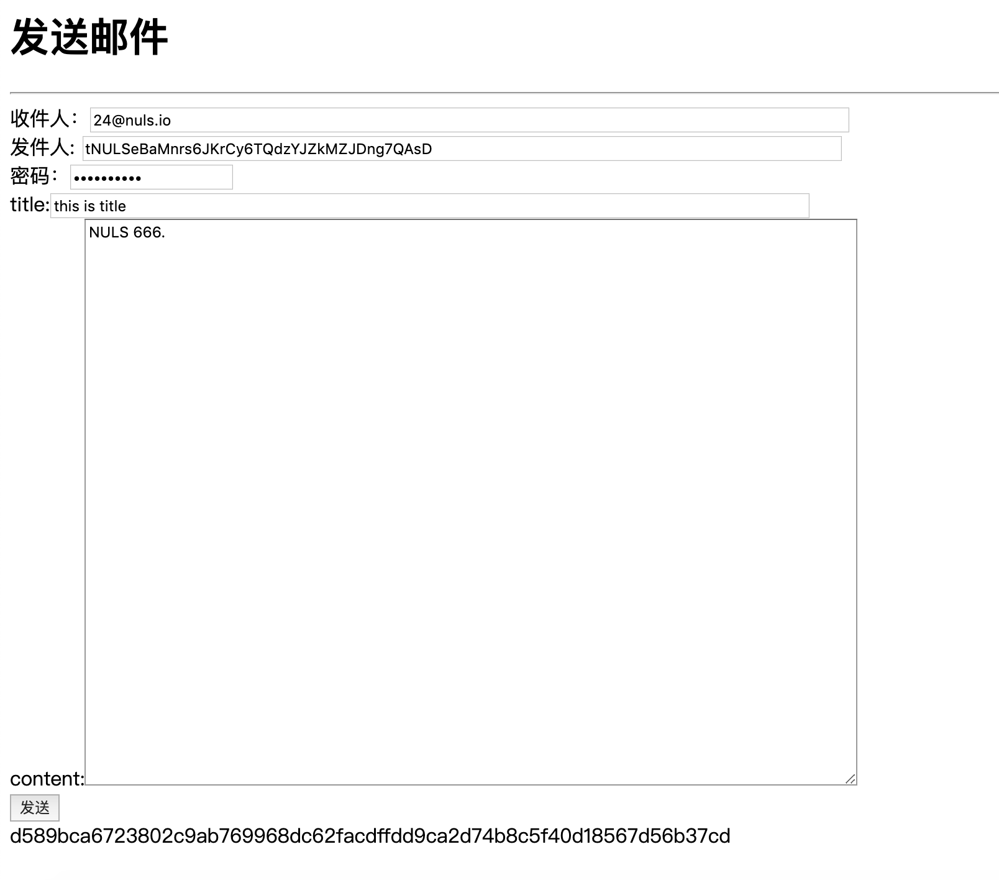

# NULS-Chainbox
## NULS-Chainbox是什么
NULS-Chainbox是一个基于NULS2.0区块链底层运行环境构建的一套区块链应用快速开发平台。它可以帮助区块链应用开发者快速构建自己的区块链应用，而无需关心区块链复杂的底层实现逻辑。它包含一套友好的开发流程和支撑流程的开发工具，以及若干的模块开发模板。

NULS2.0区块链底层运行环境基于微服务架构实现，支持多语言模块接入，Chainbox通过各种开发模板隐藏与NULS2.0模块通信的实现成本，让开发者专注于业务的实现。
##### 注：目前暂时只有java语言的模块开发模板，后续会逐渐开发其他语言，如goland、nodejs等。
## 解决的问题和适合的用户
NULS-Chainbox设计的初衷是帮助应用开发者在区块链上能快速构建自己的应用场景，专注自己的业务实现，绕开晦涩、复杂的区块链底层逻辑。可以这样类比，如果区块链应用是一辆汽车，那么业务开发者只需要设计自己汽车的外形、新的功能，而不需要关心底盘、发动机、变速箱、轮子等。

通常来说我们假设NULS-Chainbox的用户应该具备一些先决条件，比如对区块链有一定的了解、具备一定的编程能力、至少能熟练使用一门开发语言。但在未来即便不会开发，也可以用别人写好的一些模板通过完成一些配置或使用模板提供的工具完成具备一些特殊能力的区块链应用的搭建，当然这种方式就相当于只是给车子改变了颜色或增大了轮胎的尺寸而已，而无法将你的车子从轿车变成越野车。
## 特点
NULS-Chainbox本质上是NULS2.0的一个扩展应用，它的定位是一站式区块链开发平台。它有3个核心特点：
1. 快速搭建开发环境。
2. 通过模板降低应用开发入门门槛。
3. 通过约定和脚本解决模板集成的难度，实现一键生成可运行程序。

## 快速体验
在下面这个case中，你将体验到使用NULS-Chainbox快速构建一套提供加密邮件服务的区块链应用（加密邮件模块是NULS-Chainbox中的示例程序）。
### 0. 检查先决条件
1. 确保您使用的是macOS、centos7+、ubuntu 14+或者其他linux内核的操作系统。
2. 确保在您的系统中安装了git、maven、jdk11。

### 1. 获取NULS-Chainbox程序

```
git clone https://github.com/lijunzhou/nuls-engine.git chainbox
``` 
### 2. 构建业务模块
我们已经在chainbox/example中为您准备了加密邮件模块的源码。这个example是基于nuls-module-template-java这个模块开发模板开发。

```
cd example   #进入示例文件夹
./package    #执行构建脚本（模板提供）
...
# 看见以下内容表示构建完成
============ PACKAGE FINISH 🍺🍺🍺🎉🎉🎉 ===============
```
完成后会在example中生成outer文件夹。
### 3. 集成业务模块到NULS2.0运行环境中
回到chainbox根目录，执行tools脚本进行模块集成。
```
./tools -p example
...
# 看见以下内容表示构建完成
============ PACKAGE FINISH 🍺🍺🍺🎉🎉🎉 ===============
```
完成后会在chainbox根目录生成NULS-WALLET文件夹，此文件夹包含了集成了加密邮件模块的NULS2.0运行程序。
### 4. 修改区块链配置
进入NULS-WELLET文件夹，打开.default-config.ncf修改配置文件（如果同目录下有nuls.ncf，请修改nuls.ncf）。请修改以下几项:
1. minNodeAmount=2 改为 0，修改后确保1个节点也能出块。

    ```
    #最小链接节点数,当链接到的网络节点低于此参数时,会持续等待
    minNodeAmount=0
    ```
2. seedNodes=tNULSeBaMkrt4z9FYEkkR9D6choPVvQr94oYZp,tNULSeBaMoGr2RkLZPfJeS5dFzZeNj1oXmaYNe,tNULSeBaMnG8hGcyeygVeyaL5cXV38bQm1rw9M,tNULSeBaMtFXBLB35WSAnoN9ezGLLCbh7sPNNN，改为seedNodes=tNULSeBaMkrt4z9FYEkkR9D6choPVvQr94oYZp。去掉多余的出块种子地址，修改后确保在1个节点运行时也能10秒钟出一个块。
    
    ```
    #种子节点出块地址
    seedNodes=tNULSeBaMkrt4z9FYEkkR9D6choPVvQr94oYZp
    ```
3. 查看种子节点出块地址默认密码

    ```
    #请记住此密码
    password=nuls123456
    ```
5. packetMagic=20201113 改为任意的无符号16进制整数（大于0，小于4294967295），修改后确保不与网络中的其他节点组成同一网络。
    
    ```
    #网络魔法参数
    packetMagic=9999999
    ``` 
    
### 5. 启动节点程序
配置完成后，就可以启动节点程序。

```
 ./start-mykernel
LOG PATH    : ~/NULS-WALLET/Logs
DATA PATH   : ~/NULS-WALLET/data
CONFIG FILE : ~/NULS-WALLET/nuls.ncf
DEBUG       : 0
JAVA_HOME   : /Library/java/JavaVirtualMachines/jdk-11.0.2.jdk/Contents/Home
java version "11.0.2" 2019-01-15 LTS
Java(TM) SE Runtime Environment 18.9 (build 11.0.2+9-LTS)
Java HotSpot(TM) 64-Bit Server VM 18.9 (build 11.0.2+9-LTS, mixed mode)

====================
NULS-WALLET STARING
====================
```
看到以上内容说明模块进入启动环节。
### 6. 检查各个模块启动状态
NULS2.0提供了检查基础模块启动状态的工具，通过工具查看各个基础模块是否启动完成。

```
./check-status 

==================MODULE PROCESS====================
account PROCESS IS START
block PROCESS IS START
consensus PROCESS IS START
ledger PROCESS IS START
network PROCESS IS START
transaction PROCESS IS START
==================RPC REDAY MODULE==================
account RPC READY
block RPC READY
consensus RPC READY
ledger RPC READY
network RPC READY
transaction RPC READY
======================REDAY MODULE==================
account STATE IS READY
block STATE IS READY
consensus STATE IS READY
ledger STATE IS READY
network STATE IS READY
transaction STATE IS READY
================TRY RUNNING MODULE==================
account TRY RUNNING
block TRY RUNNING
consensus TRY RUNNING
ledger TRY RUNNING
network TRY RUNNING
transaction TRY RUNNING
===================RUNNING MODULE===================
account STATE IS RUNNING
block STATE IS RUNNING
consensus STATE IS RUNNING
ledger STATE IS RUNNING
network STATE IS RUNNING
transaction STATE IS RUNNING
==================NULS WALLET STATE=================
==========================
NULS WALLET IS RUNNING
==========================
```
看到以上内容表示节点基础模块已完成启动工作。
### 6. 导入种子出块节点地址
进入命令行导入默认的种子出块地址。

```
./cmd 
JAVA_HOME:/Library/java/JavaVirtualMachines/jdk-11.0.2.jdk/Contents/Home
java version "11.0.2" 2019-01-15 LTS
Java(TM) SE Runtime Environment 18.9 (build 11.0.2+9-LTS)
Java HotSpot(TM) 64-Bit Server VM 18.9 (build 11.0.2+9-LTS, mixed mode)

Service Manager URL: ws://127.0.0.1:7771

 __    __ __    __ __        ______          ______          ______  __       ______
/  \  /  /  |  /  /  |      /      \        /      \        /      \/  |     /      |
$$  \ $$ $$ |  $$ $$ |     /$$$$$$  |      /$$$$$$  |      /$$$$$$  $$ |     $$$$$$/
$$$  \$$ $$ |  $$ $$ |     $$ \__$$/       $$____$$ |      $$ |  $$/$$ |       $$ |
$$$$  $$ $$ |  $$ $$ |     $$      \        /    $$/       $$ |     $$ |       $$ |
$$ $$ $$ $$ |  $$ $$ |      $$$$$$  |      /$$$$$$/        $$ |   __$$ |       $$ |
$$ |$$$$ $$ \__$$ $$ |_____/  \__$$ |      $$ |_____       $$ \__/  $$ |_____ _$$ |_
$$ | $$$ $$    $$/$$       $$    $$/       $$       |      $$    $$/$$       / $$   |
$$/   $$/ $$$$$$/ $$$$$$$$/ $$$$$$/        $$$$$$$$/        $$$$$$/ $$$$$$$$/$$$$$$/

Module:cmd-client

waiting nuls-wallet base module ready
 2 3nuls-wallet base module ready
nuls>>> import b54db432bba7e13a6c4a28f65b925b18e63bcb79143f7b894fa735d5d3d09db5 #通过私钥导入种子节点地址（此私钥与第4步第2条修改的地址相匹配，必须严格保持一致）
Please enter the password (password is between 8 and 20 inclusive of numbers and letters), If you do not want to set a password, return directly.
Enter your password:**********  #设置导入地址的密码，此密码与第4步第3条记录的密码必须一致）
Please confirm new password:********** #重复上一步输入的密码
tNULSeBaMkrt4z9FYEkkR9D6choPVvQr94oYZp #导入地址成功，验证此地址是否与第4步第2条的配置项完全一致
nuls>>> network info  #查看节点状态，如果高度为0，等待10秒后再重新执行查看。
{
  "localBestHeight" : 1,  #本地区块高度
  "netBestHeight" : 1,    #网络区块高度(本示例只有1个节点，所以网络高度等于本地高度
  "timeOffset" : 12,
  "inCount" : 0,
  "outCount" : 0
}
```
### 7. 运行加密邮件demo
1. 准备测试账户。
    准备2个账户，用于测试发送和接收邮件,这两个地址是测试环境创世块中定义的地址，账户中有一定数量的资产供测试使用。
    
    ```
    nuls>>> import 477059f40708313626cccd26f276646e4466032cabceccbf571a7c46f954eb75
Please enter the password (password is between 8 and 20 inclusive of numbers and letters), If you do not want to set a password, return directly.
Enter your password:**********
Please confirm new password:**********
tNULSeBaMnrs6JKrCy6TQdzYJZkMZJDng7QAsD
nuls>>> 
nuls>>> import 8212e7ba23c8b52790c45b0514490356cd819db15d364cbe08659b5888339e78
Please enter the password (password is between 8 and 20 inclusive of numbers and letters), If you do not want to set a password, return directly.
Enter your password:**********
Please confirm new password:**********
tNULSeBaMrbMRiFAUeeAt6swb4xVBNyi81YL24
    ```
1. 绑定账户邮箱地址。
    进入NULS-WELLET/Modules/Nuls/mail-example/1.0.0目录，用浏览器打开ui.html（这是一个简单的测试页面，可以测试绑定邮箱地址、收发邮件等功能）。
    
    输入两个测试账户地址、设置一个邮箱地址、输入刚才设置的测试账户密码。提交成功后将返回此交易的hash值。此处我们申请邮箱地址分别为asd@nuls.io和l24@nuls.io。
2. 发送邮件。
    现在我们测试用asd@nuls.io向l24@nuls.io发送邮件。注意发件人使用的是账户地址。
    
    
    输入收件人邮箱地址、发件人账户地址、发件人账户密码。提交成功后将返回此交易的hash值。
1. 查看邮件内容
    等待大约10秒钟后（确保交易已经确认），通过发送邮件的hash值查看邮件内容，只有发件人和收件人才能查看。
    
    
    ```
    {
        "senderMailAddress": "asd@nuls.io",   //发件人邮箱地址
        "receiverMailAddress": "24@nuls.io",  //收件人邮箱地址
        "title": "this is title",             //邮件标题
        "content": "NULS 666.",               //邮件内容
        "sender": "tNULSeBaMnrs6JKrCy6TQdzYJZkMZJDng7QAsD",   //发件人账户地址
        "date": 1561365228904                 //发件时间戳（1970年1月1日到当前的毫秒数）
    }
    ```
### 8. 加密邮件模块设计文档
[加密邮件模块设计文档](./example/模块设计文档.md)

## 模块模板列表
[java模块开发模板](https://github.com/nuls-io/nuls-module-template-java)
区块链浏览器模板
浏览器钱包模板
## 文档列表
[NULS-Chainbox使用指南](./document/use-guide.md)
[java模块开发模板使用文档](https://github.com/nuls-io/nuls-module-template-java)
[机密邮件示例模块设计文档](./example/模块设计文档.md)
账户模块RPC接口文档
账本模块RPC接口文档
交易模块RPC接口文档
区块模块RPC接口文档
共识模块RPC接口文档
网络模块RPC接口文档